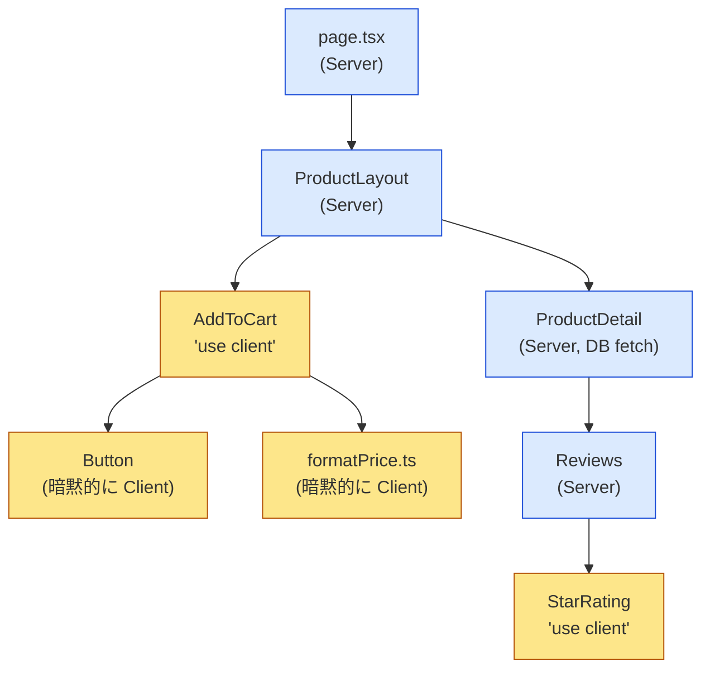
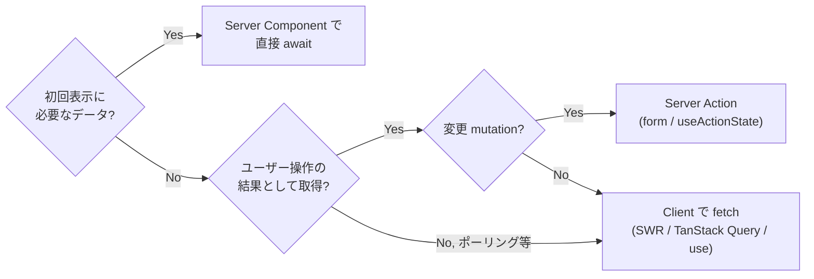
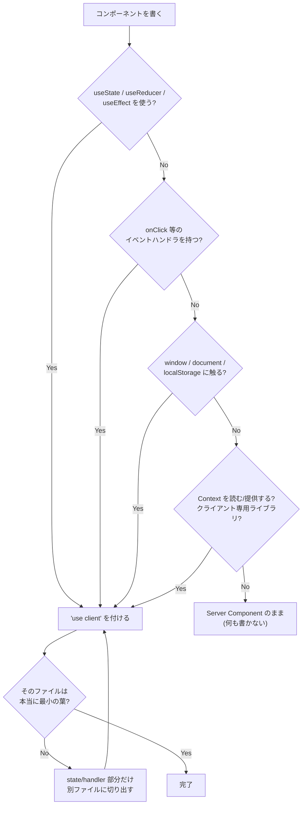

# 🧠 React Server Components と Client Components の使い分け

> [!abstract] 要約
> ==既定は Server Component、インタラクション・ブラウザ API・React state が必要な「葉」だけ Client Component== にする。
> `'use client'` は「クライアントで動くコンポーネント」の宣言ではなく、**サーバー/クライアント境界の宣言**。境界より下は全て Client バンドルに入る。
> データ取得はできる限り Server Component で `await` し、Client には整形済みの ==シリアライズ可能な props== だけを渡す。

## 📌 ポイント

- **Server Component (RSC) がデフォルト**。Next.js App Router では `'use client'` を付けない限り全てサーバーで実行され、JS バンドルには含まれない。
- **`'use client'` はファイル単位の境界宣言**。そのファイルが import する全モジュールがクライアント側に引き込まれる。
- **Client Component は Server Component を import できない**。ただし ==`children` や props として受け取る== ことはできる（「穴を開ける」パターン）。
- **境界を越える props はシリアライズ可能でなければならない**。関数・クラスインスタンス・Date 以外の複雑なオブジェクトは渡せない（Server Action は例外）。
- **Client Component は「クライアントでしか動かない」わけではない**。SSR で HTML は生成される。動かないのは `async` コンポーネントと DB アクセス等。
- 判断の指針は ==「インタラクションと state を持つ最小の葉だけ Client に切り出す」==。ページやレイアウト全体に `'use client'` を付けるのは最も典型的なアンチパターン。

## 🔍 詳細

### 2 種類のコンポーネントの比較

| 観点 | Server Component | Client Component |
|---|---|---|
| 宣言 | 既定（何も書かない） | ファイル先頭に `'use client'` |
| 実行場所 | サーバーのみ（ビルド時 or リクエスト時） | サーバー（SSR）**と**ブラウザ |
| JS バンドル | ❌ 含まれない | ✅ 含まれる |
| `async` / `await` | ✅ 使える | ❌ 使えない |
| DB・ファイル・秘密情報 | ✅ 直接触れる | ❌ 触れない（漏洩リスク） |
| `useState` / `useEffect` / `useReducer` | ❌ | ✅ |
| イベントハンドラ (`onClick` 等) | ❌ | ✅ |
| ブラウザ API (`window`, `localStorage`) | ❌ | ✅（`useEffect` 内や guard 付きで） |
| Context の Provider / consumer | ❌ | ✅ |
| 再レンダリング | リクエスト単位（再取得時） | state 変更で通常の React 再レンダリング |
| 相手側の import | Client を import ✅ | Server を import ❌（props で受け取る） |

### 境界がどう伸びるか

`'use client'` を付けたファイルから import される依存は、**明示しなくても**全て Client バンドルに入る。境界は「上から下」にしか伸びない。



青 = サーバーのみ、黄 = クライアントバンドルに含まれる。`Button` や `formatPrice` は `'use client'` を書いていなくても、Client Component から import された時点でバンドルに乗る。

> [!warning] 境界を上に置きすぎる
> `layout.tsx` や `page.tsx` に `'use client'` を付けると、配下の全ツリーが Client になり RSC の恩恵（バンドル削減・サーバー側データ取得）がほぼ消える。「state が 1 つ必要だから」で親に付けず、==state を使う部分だけを別ファイルに切り出して== そこに付ける。

### 境界の置き方 — 3 つの定石

1. **葉に押し下げる（Push down）** — インタラクティブな部分だけを小さい Client Component に分離する。
   ```tsx
   // ProductPage.tsx (Server)
   export default async function ProductPage({ params }) {
     const product = await db.product.find(params.id); // サーバーで取得
     return (
       <article>
         <h1>{product.name}</h1>
         <AddToCart productId={product.id} price={product.price} />  {/* Client */}
       </article>
     );
   }
   ```
2. **children で穴を開ける（Composition / Slot）** — Client Component の中に Server Component を置きたいときは、import せず `children` や名前付き props で渡す。
   ```tsx
   // Tabs.tsx
   'use client';
   export function Tabs({ tabs, children }: { tabs: string[]; children: React.ReactNode }) {
     const [active, setActive] = useState(0);
     return <>
       <nav>{tabs.map((t, i) => <button key={t} onClick={() => setActive(i)}>{t}</button>)}</nav>
       {children /* Server Component の出力がそのまま入る */}
     </>;
   }

   // page.tsx (Server)
   <Tabs tabs={['概要', 'レビュー']}>
     <ServerRenderedReviews productId={id} />
   </Tabs>
   ```
3. **Provider は最上位の薄い Client ラッパーに** — Theme / Auth などの Context Provider は `'use client'` の小さなコンポーネントにし、`layout.tsx` (Server) から `children` を渡す。Provider 自体は Client でも、その `children` は Server のままでいられる。

> [!tip] 「ファイルを分ける」が答えになることが多い
> 1 ファイルの中で Server と Client を混在させることはできない。迷ったら「この state / handler だけを持つ最小コンポーネント」を新規ファイルに切り出し、そこにだけ `'use client'` を付ける。Client Component のファイル名にサフィックス（`*.client.tsx`）を付けるチーム規約も有効。

### データ取得の置き場所



| パターン | 置き場所 | 向いている用途 | 注意 |
|---|---|---|---|
| `async` コンポーネントで `await` | Server | ページ表示に必要な一次データ。DB・内部 API・秘密鍵が必要なもの | ウォーターフォールを避けるため独立した fetch は `Promise.all` で並列化 |
| Server → Client に props で渡す | 境界 | 取得済みデータをインタラクティブ UI に渡す | シリアライズ可能な値に限る。巨大な配列を丸ごと渡すとペイロードが膨らむ |
| Promise を props で渡し Client で `use()` | 境界 | 重いデータを待たずに shell を先に出す（ストリーミング） | Client 側を `<Suspense>` で包む |
| Server Action | Client → Server | フォーム送信・更新・削除。`revalidatePath` / `revalidateTag` でキャッシュ更新 | 認可チェックは Action 内で必ず行う（公開エンドポイント相当） |
| Client 側で fetch（SWR / TanStack Query） | Client | 検索のインクリメンタル取得、ポーリング、無限スクロール、ユーザー固有のリアルタイム値 | 公開 API 経由になるので秘密情報は使えない |

> [!tip] fetch の重複を恐れない
> Next.js の `fetch` はリクエスト単位でメモ化される（同 URL・同オプション）。複数の Server Component が同じデータを必要とするなら、親から props でバケツリレーせず ==それぞれの場所で fetch して良い==。ORM 直叩きの場合は React の `cache()` で同等のメモ化ができる。

> [!warning] Server Component は「サーバーでの React」であって API ではない
> Server Component 内での `await` は、レンダリングをその分だけブロックする。遅いデータは `<Suspense>` で囲んで `loading.tsx` やスケルトンを出し、ストリーミングで段階的に届けること。全部を 1 つの `await` にまとめると TTFB が最遅データに引っ張られる。

### `'use client'` を付ける判断フロー



チェックリスト形式:

- [ ] `useState` / `useReducer` / `useEffect` / `useRef`(DOM 操作) を使う → **Client**
- [ ] `onClick` / `onChange` / `onSubmit` などイベントハンドラを直接持つ → **Client**
- [ ] `window` / `document` / `navigator` / `localStorage` / `IntersectionObserver` に触る → **Client**
- [ ] `useContext` や Provider、`useRouter` / `usePathname` / `useSearchParams` を使う → **Client**
- [ ] クライアント専用ライブラリ（多くのチャート・エディタ・アニメーションライブラリ）を使う → **Client**（またはライブラリだけ薄くラップ）
- [ ] 上のどれにも当たらない → **Server のまま**。特に「データを取って表示するだけ」「秘密鍵を使う」「大きな依存（Markdown パーサ、日付ライブラリ等）で整形する」は Server が最適

> [!tip] サードパーティコンポーネントの扱い
> `'use client'` を付けていないライブラリの Client 向けコンポーネント（`useState` を内部で使う等）を Server Component から使うとエラーになる。==自前の 1 行ラッパーファイル== に `'use client'` を付けて re-export すれば解決する。
> ```tsx
> 'use client';
> export { Carousel } from 'some-carousel-lib';
> ```

### よくある誤解

| 誤解 | 実際 |
|---|---|
| 「Client Component はブラウザでだけレンダリングされる」 | SSR でサーバーでも一度描画され HTML になる。だからこそ `window` を直接参照すると SSR 時に落ちる |
| 「Server Component は SSR の新しい名前」 | 別物。SSR は Client Component を HTML 化する仕組み。RSC は JS バンドルに乗らず、サーバーでだけ実行されるコンポーネント。両者は共存する |
| 「`'use client'` は必要なコンポーネント全部に書く」 | 境界のファイルにだけ書く。その下は暗黙的に Client になる。全部に書いても動くがノイズになり境界が見えなくなる |
| 「Server Component の方が常に速い」 | ネットワーク往復が増えるケース（頻繁な小さな更新、楽観的 UI）では Client 側の state / fetch の方が体感が良い。初回表示とバンドル量で有利なのが RSC |
| 「Client Component から Server Component を import できない = 組み合わせられない」 | `children` / props で渡せば Client の中に Server を配置できる（Composition パターン） |
| 「Server Component に `useState` を書けないのは制限で、いずれ緩和される」 | 設計上の本質。Server Component はリクエストごとに使い捨てられ、クライアント上に「インスタンス」を持たないので state の置き場が無い |
| 「Server Component の props に何でも渡せる」 | 境界を越える props は RSC Payload としてシリアライズされる。関数（Server Action 以外）・クラス・Symbol・`Map`/`Set`(React 19 以降は一部対応) は渡せない |
| 「Server Component 内の `console.log` がブラウザに出ない＝動いてない」 | 出力先はサーバーのターミナル。Next.js dev では一部ブラウザにも転送されるが、基本はサーバーログを見る |
| 「環境変数はどこでも読める」 | Server Component では全環境変数を読めるが、Client に渡すには `NEXT_PUBLIC_` 接頭辞が必要。うっかり秘密情報を props で渡すとクライアントに漏れる |

> [!failure] やりがちなアンチパターン
> - `layout.tsx` に `'use client'` を付けて Provider を置く（→ 配下全体が Client に）。Provider だけ別ファイルに切り出す
> - Server Component で取得したデータを `useEffect` + `fetch` で Client から再取得する（二重取得）
> - Server Component から巨大な生データを Client に丸ごと渡す（RSC Payload と HTML の両方に埋め込まれ、転送量が倍増する）。==Client が必要とする形に絞ってから渡す==
> - Server Action 内で認可チェックをせず「Server で動くから安全」と思い込む（Action は HTTP エンドポイントとして公開されている）
> - DB クライアントや秘密情報を持つモジュールを Client Component から import する（`server-only` パッケージを import してビルド時に検知させる）

> [!info] 用語と前提
> - **RSC Payload**: サーバーが Client に送る、Server Component の描画結果 + Client Component への参照 + props を含むフォーマット。React が HTML とは別に受け取り、ツリーを再構成する
> - `'use client'` の対になる `'use server'` は「Server Action として公開する」宣言であり、==「Server Component にする」宣言ではない==（Server Component は既定なので宣言不要）
> - 本ノートは React 19 / Next.js App Router (14〜15) を前提。Pages Router には RSC は無い

## 🧪 実装時の確認

> [!example]- 境界チェックの小技
> ```ts
> // lib/db.ts の先頭に置く。Client から import されるとビルドエラーになる
> import 'server-only';
>
> // 逆に、Client 専用モジュールには
> import 'client-only';
> ```
> ```bash
> # Client バンドルに何が乗っているかを可視化する
> ANALYZE=true next build   # @next/bundle-analyzer 導入時
> ```
> ```tsx
> // Server Component で並列 fetch
> const [product, reviews] = await Promise.all([
>   getProduct(id),
>   getReviews(id),
> ]);
> ```

> [!question] 未確認・今後追う
> - [ ] React 19 の `use(promise)` を Client 側で使うストリーミングパターンの、エラー境界との組み合わせ実例
> - [ ] `'use cache'` ディレクティブ（Next.js 15+ 実験的）が導入されたときの、データ取得パターン表の更新
> - [ ] Tailwind + CSS-in-JS ライブラリ（styled-components 等）を RSC で使う際の制約整理

## 🔗 関連

- [[Next.js App Router データ取得パターン]]（未作成）— 本ノートのデータ取得表を Next.js のキャッシュ (`fetch` cache / `revalidateTag`) まで含めて掘る予定
- [[Server Actions とフォーム処理]]（未作成）— `useActionState` / `useFormStatus` / 楽観的更新をまとめる予定
- [React 公式: Server Components](https://react.dev/reference/rsc/server-components)[^1]
- [React 公式: 'use client'](https://react.dev/reference/rsc/use-client)[^2]
- [Next.js: Server and Client Components](https://nextjs.org/docs/app/getting-started/server-and-client-components)[^3]
- [Making Sense of React Server Components (Josh W. Comeau)](https://www.joshwcomeau.com/react/server-components/)[^4]

[^1]: React 公式リファレンス。Server Component の定義と `async` コンポーネントの扱い。
[^2]: `'use client'` が「境界」であること、シリアライズ可能な props の一覧はここが一次情報。
[^3]: Next.js App Router での実践的なパターン（Composition、Provider、`server-only`）。
[^4]: 図解付きで RSC と SSR の違い、境界の伸び方を説明した記事。誤解の整理に有用。
