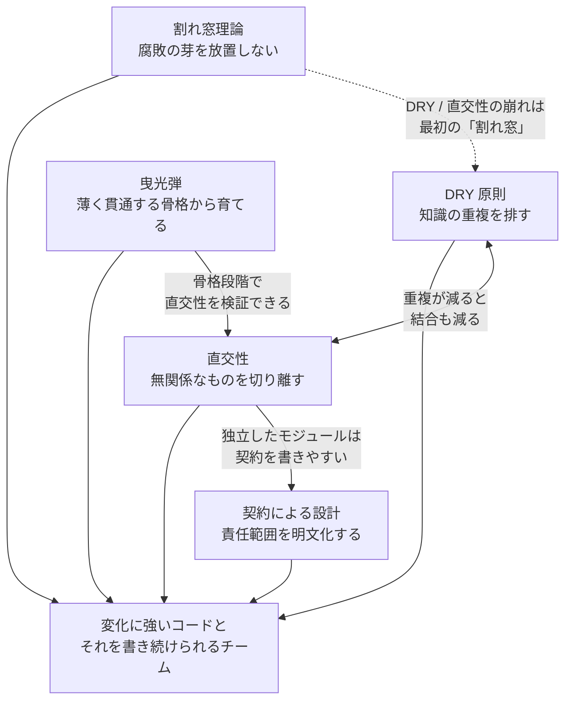

# 📚 達人プログラマー

> [!abstract] 一言でいうと
> 「特定の技術」ではなく、==知識の重複を排し、無関係なものを切り離し、小さく動くものから育て、腐敗の芽を摘み、約束を明文化する==というプログラマーの「姿勢」を説いた本。20 年以上前の初版の主張が第 2 版でもほぼそのまま通用していること自体が、原則の強さの証明。

| 項目 | 内容 |
|---|---|
| 著者 | David Thomas / Andrew Hunt（訳: 村上雅章） |
| 読了日 | 2026-09-19 |
| 評価 | ⭐⭐⭐⭐⭐（5 / 5） |
| 誰向け | 実務 2〜3 年目以降で「動くコードは書けるが、設計の判断軸が欲しい」人。チームでコードレビューの共通言語を作りたいリード |

## 💡 学び（刺さった 5 つの原則）

1. **DRY 原則（Don't Repeat Yourself）** — 「コードをコピペしない」ではなく、==知識の表現をシステム内で単一・明確・信頼できるものにする== という話。コメントとコードの二重化、ドキュメントとスキーマの二重化、チーム間の同じ処理の重複実装まで射程に入る。「コードが重複していても、表す知識が違えば DRY 違反ではない」という逆向きの注意も刺さった。
2. **直交性（Orthogonality）** — 無関係なもの同士が影響し合わないようにする。1 か所変えたら他が壊れる、という状態は直交性が崩れている合図。設計だけでなく、テストの書きやすさ・チームの分担・ツール選定の判断軸にもなる。
3. **曳光弾（Tracer Bullets）** — 暗闇で目標に当てるには、弾道が見える弾を撃って修正する。全レイヤーを薄く貫通する「動く骨格」を最初に作り、フィードバックを見ながら肉付けしていく。捨てるつもりのプロトタイプとは別物で、==曳光弾は本番コードの一部として残る==。
4. **割れ窓理論（Broken Windows）** — 割れた窓を 1 枚放置すると建物全体が荒れる。悪い設計・雑なコード・放置された TODO を「まあいいか」で残すと、チーム全体の品質基準が下がる。直せないなら「板を打ち付ける」（コメント・Issue 化）だけでもする。
5. **契約による設計（Design by Contract）** — 事前条件・事後条件・不変条件を明示し、「呼び出し側は事前条件を守る、呼ばれる側は事後条件を保証する」という契約でコードの責任範囲を切る。曖昧な入力を黙って受け入れる「寛容さ」より、==契約違反は早く・大きく失敗させる== 方が結果的に堅牢。

### 原則同士の関係



## 📝 原則ごとのメモ

### DRY 原則

> [!quote] 引用（要旨）
> すべての知識はシステム内において、単一、かつ明確な、そして信頼できる表現になっていなければならない。

- 重複の分類が実務的だった。**押し付けられた重複**（フレームワークや言語の都合）、**不注意による重複**、**手抜きによる重複**、**開発者間の重複**。手抜きと開発者間の重複が現場では圧倒的に多い。
- コメントで処理内容を書き直すのも DRY 違反。コードが変わってコメントが古くなる時点で「信頼できる表現」が 2 つに割れている。

> [!tip] コードレビューでの使い方
> 「これコピペですか？」ではなく「この 2 か所は同じ知識を表していますか？」と聞く。同じ知識なら統合、違う知識なら偶然似ているだけなので分けたままでよい。

### 直交性

- 「1 つの変更が何か所に波及するか」を数えると直交性の度合いが見える。
- 直交性が高いと **生産性**（変更が局所化する・再利用しやすい）と **リスク低減**（壊れる範囲が小さい・テストしやすい）の両方が上がる。
- グローバル状態・似た関数の乱立・コードの書き方が環境に依存している箇所が、直交性を壊す典型。

> [!warning] 注意
> 直交性を追いすぎて抽象レイヤーを増やすと、今度は「知識がどこにあるか分からない」形で DRY 側が崩れる。**変更の波及範囲** を基準にして、必要になった時点で切るのが現実的。

### 曳光弾

| 観点 | 曳光弾 | プロトタイプ |
|---|---|---|
| 目的 | 目標に向けて **弾道を修正する** | 特定の疑問に答える（使い捨て） |
| コードの扱い | 本番コードの一部として **残す** | 捨てる前提 |
| 完成度 | 機能は薄いが、全レイヤーが **動く** | 部分的で動かなくてもよい |
| 向いている場面 | 要件が曖昧・未知の技術・全体像を早く見せたい | UI の見た目確認・アルゴリズム検証 |

> [!tip] 実務での置き換え
> 「まず UI → API → DB を 1 ケースだけ通す PR を出す」が曳光弾。フロントだけ完成させてバックエンドを後回しにするのとは逆の考え方。

### 割れ窓理論

- 「ソフトウェアのエントロピー」の章。腐敗は一気に起きるのではなく、**最初の 1 枚の割れ窓が放置された瞬間** に許容ラインが動く。
- 直せない場合でも「ここは問題があると認識している」と示す（コメント・Issue・ダミー実装で塞ぐ）ことで、割れたまま放置されている状態と区別する。

> [!warning] 逆側の注意
> 「きれいなコードベースを壊す最初の 1 人になるな」も同じ理論からの帰結。締切間際の「一時的な」ハックが最も危険。

### 契約による設計

- Bertrand Meyer（Eiffel）由来の考え方。**事前条件**（呼び出し側の責任）、**事後条件**（呼ばれる側の責任）、**クラス不変条件**（常に真であるべき状態）の 3 点で契約を結ぶ。
- 契約は「防御的プログラミング」とは違う。あらゆる入力に寛容に対応するのではなく、**契約を破った側の責任を明確にする**。
- 言語のサポートが無くても、アサーション・型・早期リターンで実質的に同じ効果が出せる。

> [!example]- TypeScript で契約を表現する例
> ```ts
> // 事前条件: amount は正の整数。破ったら呼び出し側のバグとして即座に落とす
> function withdraw(account: Account, amount: number): Account {
>   if (!Number.isInteger(amount) || amount <= 0) {
>     throw new Error(`precondition violated: amount=${amount}`);
>   }
>   const next = { ...account, balance: account.balance - amount };
>   // 事後条件: 残高は減っている
>   console.assert(next.balance < account.balance, "postcondition violated");
>   // 不変条件: 残高は負にならない
>   console.assert(next.balance >= 0, "invariant violated");
>   return next;
> }
> ```

## 🎯 行動に変えること

- [ ] コードレビューで「同じ知識か、偶然似ているだけか」を確認する質問を定型化する（DRY）
- [ ] 新機能の最初の PR は、1 ケースだけ全レイヤーを貫通させる曳光弾スタイルにする
- [ ] リポジトリ内の「割れ窓」（放置 TODO・コメントアウトされたコード）を棚卸しして Issue 化する
- [ ] 公開関数には事前条件のガードを先頭に置き、契約違反は黙殺せずに例外で落とす
- [ ] 「1 つの変更で何ファイル触ったか」を PR ごとに意識し、直交性の崩れを早めに検知する

## 🔗 関連

- [[リファクタリング]]（未作成）— 割れ窓を直す具体的な手つき。達人プログラマーが「なぜ」なら、こちらは「どうやって」
- [[A Philosophy of Software Design]]（未作成）— 直交性・複雑性の議論をさらに深く掘る本
- [達人プログラマー 第2版（オーム社）](https://www.ohmsha.co.jp/book/9784274226298/)
- [The Pragmatic Programmer 20th Anniversary Edition（原著）](https://pragprog.com/titles/tpp20/the-pragmatic-programmer-20th-anniversary-edition/)
