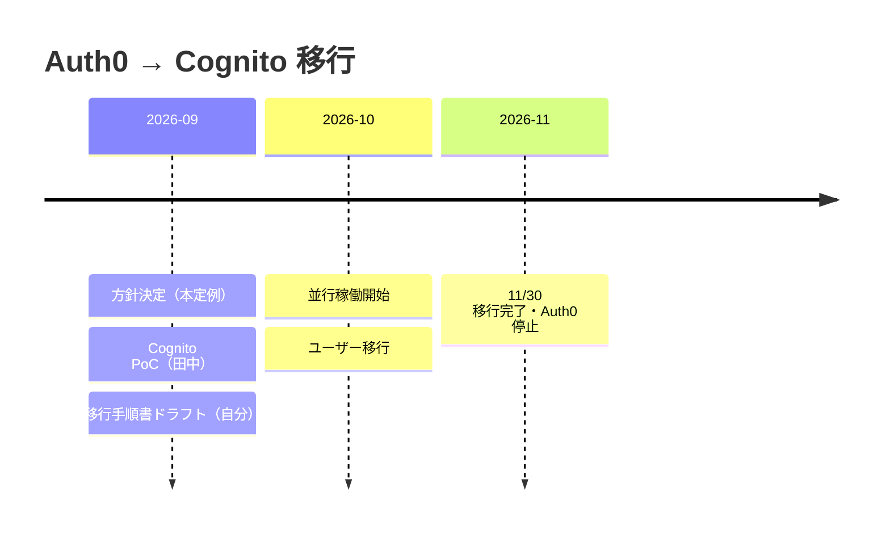

# 💼 IJU 定例: 認証基盤の Auth0 → Cognito 移行

> [!abstract] 結論
> コスト削減のため、IJU の認証基盤を ==Auth0 から Amazon Cognito に移行する== ことが決定。
> 期限は ==2026 年 11 月末==。移行期間中は Auth0 と Cognito を並行稼働させる。
> 最大の未決事項は既存ユーザーのパスワード移行方法（Cognito はパスワードハッシュの持ち込み不可）。

| 項目 | 内容 |
|---|---|
| 日時 | 2026-09-19 |
| 会議 | IJU 定例 |
| 参加者 | 自分、田中さん ほか |
| 目的 | 認証基盤の移行方針と当面のアクションの確定 |

## ✅ 決定事項

| # | 決定 | 理由・補足 |
|---|---|---|
| 1 | 認証を **Auth0 → Cognito** に移行する | コスト理由 |
| 2 | 移行期限は **2026-11-30** | 残り約 2 か月半 |
| 3 | 移行中は **Auth0 と Cognito を並行稼働** | 一斉切替ではなく段階的に移す |

## 🗓️ 移行スケジュール

## 💬 議論メモ

- コスト → Auth0 の費用が負担になっており、Cognito へ移行する方針で合意
- 切替方式 → 一斉切替はリスクが高いため、移行期間中は両方を並行稼働させる
- パスワード移行 → Cognito は既存のパスワードハッシュをインポートできないため、方法が決まらず持ち越し

> [!warning] 並行稼働時の注意
> 2 系統の認証が同時に存在するため、どのユーザーがどちらで認証されるかの判定ロジックと、セッション・トークンの整合性を手順書側で明確にしておく必要がある。

> [!question] 持ち越し: 既存ユーザーのパスワード移行方法
> Cognito はパスワードハッシュの持ち込みができないため、ユーザーに再設定を求めずに移行する方法を検討中。
> 候補として想定されるもの（次回までに整理）:
> - [ ] ユーザー移行 Lambda トリガー（初回ログイン時に Auth0 で検証 → Cognito にユーザー作成）
> - [ ] 全ユーザーへのパスワード再設定依頼（一括インポート + 強制リセット）
> - [ ] 上記の組み合わせ（アクティブユーザーは Lambda、非アクティブは再設定）

## 📋 アクション

- [ ] **田中さん** — Cognito の PoC（期限: 来週 2026-09-25 頃）
- [ ] **自分** — 移行手順書のドラフト作成（期限: 2026-09-25 金曜）
- [ ] **全員** — 既存ユーザーのパスワード移行方法を次回定例で決める

## 🔗 関連

- [[IJU 認証移行手順書 (Auth0 → Cognito)]]（未作成 — 金曜までに書くドラフトの置き場）
- [[判断: IJU 認証基盤を Auth0 から Cognito に移行]]（未作成 — 移行判断を ADR として残す）
- [Amazon Cognito ユーザープールへのユーザー移行](https://docs.aws.amazon.com/cognito/latest/developerguide/cognito-user-pools-import-users.html)
