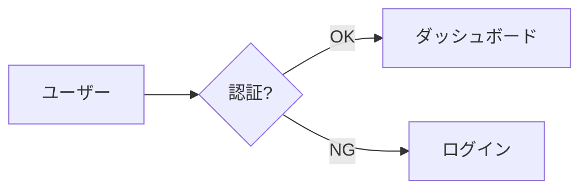

# Obsidian 記法チートシート

Obsidian のリーディングビューで「リッチに」見える記法と、その使い分け。コミュニティプラグイン無しで動く標準記法だけを載せている。

## 目次

1. frontmatter プロパティ
2. コールアウト（種類・折りたたみ・ネスト）
3. 表
4. Mermaid 図
5. リンク・埋め込み・タグ
6. 強調・脚注・コメント・数式
7. 使い分けの判断基準
8. やらないこと

---

## 1. frontmatter プロパティ

`---` で囲んだ YAML。Obsidian は上部に「プロパティ」UI として表示し、`YYYY-MM-DD` は日付型、リストはタグ/リスト型として認識する。スクリプトが生成するので通常は手書きしないが、形は把握しておく。

```yaml
---
title: Qwen3.5 ローカル運用メモ
type: knowledge
status: 🌿 growing
created: 2026-09-18
updated: 2026-09-18
tags:
  - ai
  - llm/local
aliases:
  - Qwen ローカル
source: https://example.com
---
```

- `tags` は `#` 無しで書く。`ai/llm` のようにスラッシュでネストできる（タグペインで階層表示）。
- `aliases` に入れた語でもクイックスイッチャーから開ける。略称・英語名を入れると探しやすい。
- `status` の 🌱 draft / 🌿 growing / 🌳 evergreen は「ノートの熟成度」。Bases やタグペインでフィルタしやすい。

## 2. コールアウト

```markdown
> [!type] 任意のタイトル
> 本文。複数行可。
> - リストも入る
```

| type（別名） | 色 | 用途 |
|---|---|---|
| `abstract` (`summary`, `tldr`) | 緑 | **冒頭の要約**。必ず置く |
| `note` | 青 | 補足・背景 |
| `info` | 青 | 前提条件・バージョン情報 |
| `tip` (`hint`, `important`) | 水色 | コツ・ベストプラクティス |
| `todo` | 青 | やること |
| `success` (`check`, `done`) | 緑 | うまくいった方法・結論 |
| `question` (`help`, `faq`) | 黄 | 未解決の疑問・要確認 |
| `warning` (`caution`, `attention`) | 橙 | 注意点・ハマりどころ |
| `failure` (`fail`, `missing`) | 赤 | 失敗した方法・アンチパターン |
| `danger` (`error`) | 赤 | 破壊的操作・データ消失リスク |
| `bug` | 赤 | 既知バグ・回避策 |
| `example` | 紫 | 具体例・サンプルコード |
| `quote` (`cite`) | 灰 | 引用 |

### 折りたたみ

```markdown
> [!example]- 長いサンプル（クリックで展開）
> デフォルト閉じ。長いコード・ログ・補足を入れて本筋を軽くする。

> [!faq]+ よくある質問
> デフォルト開き。折りたためることを示す。
```

### ネスト

```markdown
> [!tip] 外側
> > [!warning] 内側
> > 注意付きのコツ、のような複合表現に。
```

### コールアウト内のコードブロック

```markdown
> [!example]- 設定ファイル
> ```json
> { "key": "value" }
> ```
```

## 3. 表

```markdown
| 項目 | A | B |
|---|:---:|---:|
| 速度 | ⭐⭐⭐ | ⭐⭐ |
| コスト | 低 | 高 |
```

- 比較・スペック・選択肢の一覧は表にする。3 項目 × 2 軸以上あれば表。
- セル内で `**太字**`・絵文字・`[[リンク]]`・`==ハイライト==` が使える。⭐ や ✅ ❌ で評価を可視化すると読みやすい。
- セル内の `|` は `\|` にエスケープ。改行は `<br>`。

## 4. Mermaid 図

````markdown

````

| 図 | 向いている内容 |
|---|---|
| `flowchart LR/TD` | 処理フロー・依存関係・分岐 |
| `sequenceDiagram` | API 呼び出し順序・複数コンポーネント間のやりとり |
| `stateDiagram-v2` | 状態遷移 |
| `mindmap` | 概念の階層・ブレスト整理 |
| `timeline` | 年表・スケジュール |
| `gantt` | 工程 |
| `classDiagram` / `erDiagram` | データモデル |

日本語ラベルは `A[日本語]` のように角括弧で囲めばそのまま使える。ラベル内の改行は `<br>`。ノードが 4 つ以上の関係を文章で説明しそうになったら図にする。

> [!warning] 色の直書きは避ける
> `style A fill:#dbeafe` のような色指定はライトテーマ前提になり、ダークテーマで文字が読めなくなる。区別したいときは `classDef` を使わず、ノードの形（`[ ]` `( )` `{ }` `[[ ]]`）やサブグラフ `subgraph Server ... end` で表現する。

## 5. リンク・埋め込み・タグ

| 記法 | 意味 |
|---|---|
| `[[ノート名]]` | 内部リンク。ファイル名 = ノート名 |
| `[[ノート名\|表示テキスト]]` | 表示テキストを変える |
| `[[ノート名#見出し]]` | 見出しへリンク |
| `![[ノート名]]` | ノート全体を埋め込み |
| `![[ノート名#見出し]]` | セクションだけ埋め込み |
| `![[image.png\|400]]` | 画像を幅指定で埋め込み |
| `#tag` `#tag/sub` | インラインタグ。本文中ではなく frontmatter に寄せるのが基本 |
| `[テキスト](https://...)` | 外部リンク |

- 既存ノートへのリンクはボルトのネットワーク価値を上げる。`obsidian_note.py tree` で得たタイトルを正確に使う。
- まだ無いノートへのリンクは「作る予定」の合図として 1〜2 個までに絞る。

## 6. 強調・脚注・コメント・数式

| 記法 | 表示 |
|---|---|
| `==重要==` | 黄色ハイライト。1 セクションに 1〜2 箇所まで |
| `**太字**` `*斜体*` `~~取り消し~~` | 標準 |
| `本文[^1]` + 末尾 `[^1]: 出典` | 脚注。外部情報の出典に |
| `%% コメント %%` | リーディングビューに出ない編集メモ |
| `$E = mc^2$` / `$$ ... $$` | LaTeX 数式 |
| `- [ ]` `- [x]` | チェックボックス。TODO・確認事項に |
| `---` | 水平線。セクションの大きな切れ目に |

## 7. 使い分けの判断基準

| 書こうとしている内容 | 使う記法 |
|---|---|
| このノートの結論 | 冒頭 `> [!abstract]` |
| 複数の選択肢の比較 | 表 + ⭐/✅ |
| 手順 | 番号付きリスト。各手順にコマンドはコードブロック |
| ハマった点・注意 | `> [!warning]` |
| うまくいった知見 | `> [!tip]` または `> [!success]` |
| 試して駄目だった方法 | `> [!failure]`（後で同じ穴に落ちない） |
| 未解決・要確認 | `> [!question]` + `- [ ]` |
| 長いコード・ログ | `> [!example]-`（折りたたみ） |
| 要素間の関係・流れ | Mermaid |
| 出典 | 脚注 or `## 🔗 関連` に外部リンク |
| 他ノートとの関係 | `[[wikilink]]`、末尾の `## 🔗 関連` |

## 8. やらないこと

- Dataview / Templater / Tasks などプラグイン専用構文（このボルトには入っていない）
- HTML タグの多用（`<br>` と `<details>` 以外は避ける。テーマ依存で崩れる）
- 見出しレベルの飛ばし（`##` の次に `####`）。アウトラインが崩れる
- 1 ノート内で同じコールアウト型を 5 個以上並べる。強調が薄まる
- 空のセクション。内容が無ければ見出しごと削る
