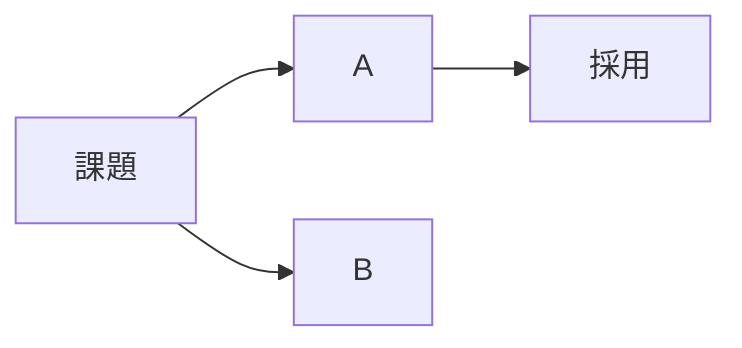

# ノート型別テンプレート

各型の「見出し構成」と「frontmatter の値」。本文の記法は `formatting.md` を参照。
見出しは必要なものだけ使い、中身の無いセクションは削る。絵文字は視覚的な索引なので見出しごとに 1 つ。

## 目次

1. knowledge — 知識・技術メモ
2. howto — 手順・ハウツー
3. book — 読書メモ
4. event — 勉強会・カンファレンス
5. work — 業務・会議メモ
6. decision — 判断記録（ADR 風）
7. 共通の締め（🔗 関連）

---

## 1. knowledge — 知識・技術メモ

`--type knowledge` / 推奨タグ: 分野タグ（`ai`, `frontend`, `backend` …）+ 具体技術タグ

```markdown
# 🧠 タイトル

> [!abstract] 要約
> 何が分かったか、どう使うかを 3 行以内で。

## 📌 ポイント
- 結論を箇条書きで 3〜5 個。==最重要== はハイライト

## 🔍 詳細
### 概念 / 仕組み
本文。4 要素以上の関係は Mermaid に。

### 比較
| 観点 | A | B |
|---|---|---|

> [!tip] コツ
> 実際に使うときの知見

> [!warning] 注意
> ハマりどころ・制約

## 🧪 試したこと
> [!example]- コマンド・コード（折りたたみ）
> ```bash
> ...
> ```

> [!question] 未確認
> - [ ] 確認したいこと

## 🔗 関連
```

## 2. howto — 手順・ハウツー

`--type howto` / 推奨タグ: `howto` + 対象技術

```markdown
# 🛠️ タイトル

> [!abstract] 要約
> 何ができるようになる手順か。所要時間の目安。

> [!info] 前提
> - OS / バージョン / 必要な権限

## 📋 手順
1. **見出し的な一言** — 説明
   ```bash
   command
   ```
2. ...

> [!success] 完了確認
> どうなっていれば成功か

## 🩹 トラブルシュート
| 症状 | 原因 | 対処 |
|---|---|---|

> [!failure] やってはいけない方法
> 試して駄目だったこと・破壊的な操作

## 🔗 関連
```

## 3. book — 読書メモ

`--type book` / `--source "著者『書名』"` / 推奨タグ: `book` + ジャンル

```markdown
# 📚 書名

> [!abstract] 一言でいうと
> この本の主張を 1〜2 文で。

| 項目 | 内容 |
|---|---|
| 著者 | |
| 読了日 | 2026-09-18 |
| 評価 | ⭐⭐⭐⭐☆ |
| 誰向け | |

## 💡 学び（3 つ）
1. **…** — なぜ刺さったか
2. …
3. …

## 📝 章ごとのメモ
### 第 1 章 …
> [!quote] 引用
> 「…」(p.12)

## 🎯 行動に変えること
- [ ] 明日からやること

## 🔗 関連
```

## 4. event — 勉強会・カンファレンス

`--type event` / ファイル名は `2026-09-18 イベント名` 形式 / 推奨タグ: `event` + テーマ

```markdown
# 🎤 イベント名

> [!abstract] 要約
> 全体を通しての学び・雰囲気を 3 行で。

| 項目 | 内容 |
|---|---|
| 日時 | 2026-09-18 |
| 会場 / 形式 | オンライン / 現地 |
| 公式 | [URL](https://) |

## 🗣️ セッションメモ
### セッション名（登壇者）
- 要点
> [!tip] 持ち帰り

## 🤝 会話・ネットワーキング
- 誰と何を話したか

## 🎯 持ち帰りアクション
- [ ] 試すこと

## 🔗 関連
```

## 5. work — 業務・会議メモ

`--type work` / `--dir Works/<プロジェクト>` / ファイル名は `2026-09-18 会議名` 形式 / 推奨タグ: `work` + プロジェクト名

```markdown
# 💼 会議名 / トピック

> [!abstract] 結論
> 決まったこと・次の一手を 3 行で。

| 項目 | 内容 |
|---|---|
| 日時 | 2026-09-18 |
| 参加者 | |
| 目的 | |

## ✅ 決定事項
- 

## 💬 議論メモ
- 論点 → 結論

> [!question] 持ち越し
> 未決の論点

## 📋 アクション
- [ ] 誰が / 何を / いつまで

## 🔗 関連
```

## 6. decision — 判断記録（ADR 風）

`--type decision` / 推奨タグ: `decision` + 領域

```markdown
# ⚖️ 判断: タイトル

> [!abstract] 結論
> 何を選んだか。1 文。

| 項目 | 内容 |
|---|---|
| 状態 | 提案 / 採用 / 廃止 |
| 日付 | 2026-09-18 |

## 🧩 背景・課題
なぜ決める必要があったか

## 🔀 選択肢
| 選択肢 | 利点 | 欠点 | 判定 |
|---|---|---|:---:|
| A | | | ✅ |
| B | | | ❌ |



## 🎯 決定と理由

## 📉 影響・トレードオフ
> [!warning] 受け入れたリスク

## 🔗 関連
```

## 7. 共通の締め（🔗 関連）

すべての型の末尾に置く。

```markdown
## 🔗 関連
- [[既存ノート名]] — どう関係するか一言
- [[これから作るノート]]（未作成）
- [公式ドキュメント](https://...)

[^1]: 脚注の出典
```
